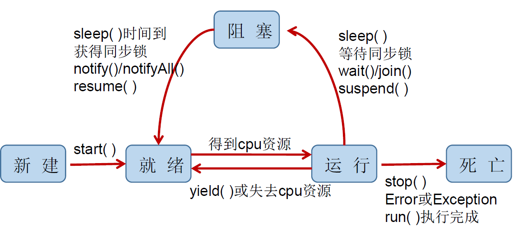

# 多线程

## 多线程的四种创建方式

> 继承Thread类  
```java
public static class MyThread extends Thread{
        public MyThread() {
        }

        public MyThread(String name) {
            super(name);
        }

        @Override
        public void run() {
            System.out.println("通过继承Thread类，来实现多线程");
        }
    }
```
> 实现Runnable接口  
```java
public static class MyRunnable implements Runnable{
        @Override
        public void run() {
            System.out.println("通过实现Runnable接口，来实现多线程");
        }
    }
```
> 实现Callable接口  
```java
public static class MyCallable implements Callable<String>{
        @Override
        public String call() throws Exception {
            return "通过实现Callable接口，来实现多线程";
        }
    }
```
> 使用线程池
```java
public class CreateThreadTest {

    public static void main(String[] args) throws Exception{
        ExecutorService executors = Executors.newFixedThreadPool(5);
        executors.submit(new CreateThread.MyRunnable());
        Future<String> submit = executors.submit(new CreateThread.MyCallable());
        String result = submit.get();
        System.out.println(result);
        executors.shutdown();
    }
}
```

## Thread类有关的方法
1. void start() 启动线程，并执行run方法
2. void run() 线程在被调度的时候执行
3. String getName() 获得线程名
4. void setName(String name) 设置线程名
5. static Thread currentThread() 返回当前线程，如果在Thread子类中就是this，通常用于主线程和Runnable的子类
6. join() 在一个程序中调用另一个程序的join方法，则该程序被阻塞直至另一个程序运行结束

## 线程的优先级
MAX_PRIORITY 10
MIN_PRIORITY 1
NORM_PRIORITY 5
1. getPriority() 获得当前线程的优先级
2. setPriority(int priority) 设置当前线程的优先级

## 守护线程
setDaemon(true) 把一个用户线程变为守护线程

## 线程的生命周期
> Thread.State中定义了线程的几种状态

* 新建  
当一个Thread类或其子类被声明并创建时，线程对象处于就绪状态
* 就绪  
处于新建状态的线程被start()后，将进入线程队列等待CPU时间片，此时它以具备了运行的条件，只是没分配到CPU资源
* 运行  
当就绪的线程被调度并获得CPU资源时，便进入运行状态，run()定义了线程的操作和功能
* 阻塞  
在某种特殊的情况下，被人为挂起，或执行输入输出操作，让出CPU并临时终止自己的执行，进入阻塞状态
* 死亡  
1. 线程完成了它的全部工作
2. 线程被提前强制的终止
3. 出现异常导致结束

**线程状态转换图**


## 线程的同步
1. 问题的原因  
当多条语句在操作同一个线程共享数据时，对只执行了部分还没有执行完，另一个线程参与进来。导致共享数据的错误

2. 解决办法  
对多条操作共享数据的语句，只能让一个线程都执行完在过中其他不可以参与执行

### synchronized
别名：同步锁，监视器锁，互斥锁

```java
同步代码块
synchronized(对象){
    //需要被同步的代码    
}

同步方法
public synchronized void method(){
    //需要被同步的代码    
}
```
**注意**
1. 必须保证使用同一个资源的多个线程***共用一把锁***
2. 一个线程类中的所有静态方法共用一把锁(类名.class)，所有非静态方法共用一把锁(this)，同步代码块(执行需谨慎)

### 同步的范围

1. 如何找问题，即代码是否存在线程安全?(非常重要)
    (1)明确哪些代码是多线程运行的
    (2)明确多个线程是否有共享数据
    (3)明确多线程运行代码中是否有条语句操作共享数据
2. 如何解决呢?(非常重要)
对多条操作共享数据的语句，只能让一个线程都执行完，在执行过程中，其他线程不可以参与执行 。
即所有操作共享数据的这些语句都要放在同步范围中
3. 切记 ：
    范围太小：没锁住所有安全问题的代码
    范围太大：没发挥多线程的 功能 。

### 释放锁的操作
* 当前线程的同步方法、代码块执行结束。
* 当前线程在同步代码块、方法中遇到 break、return终止了该代码块、该方法的继续执行。
* 当前线程在同步代码块、方法中出现了未处理的Error或Exception，导致异常结束。
* 当前线程在同步代码块、方法中执行了对象的wait() 方法，当前线程

## 死锁
> 产生死锁的原因
> 1. 互斥条件
> 2. 持有并等待条件
> 3. 不可剥夺条件
> 4. 环路等待条件

解决的方法
* 专门的算法、原则
+ 尽量减少同步资源 的定义
- 尽量避免嵌套同步

## Lock锁

1. 从JDK 5.0 开始，Java 提供了更强大的线程同步机制通过显式定义同步锁对象来实现同。使用Lock对象充当
2. java.util.concurrent.locks.Lock接口是控制多个线程对共享资源进行访问的工具
锁提供了对共享资源的独占访问，每次只能有一个线程Lock对象加锁，线程开始访问共享资源之前应先获得Lock对象
3. ReentrantLock 类实现了Lock，它拥有与synchronized相同的并发性和内存语义，在实现线程安全的控制中，
比较常用是ReentrantLock，可以显式加锁、释放

```java
import java.util.concurrent.locks.ReentrantLock;
public class MyLock{
    private final Lock lock = new ReentrantLock();
    public void method(){
           lock.lock();
            try{
                //保证线程安全的代码
            }finally{
                lock.unlock();
            }
    }
}
```

## synchronized和Lock对比
1. Lock是显式锁（手动开启和关闭，别忘记），synchronized是隐式锁，出了作用域自动释放
2. Lock只有代码块锁，synchronized有代码块锁和方法锁
3. 使用Lock锁，JVM将花费较少的时间来调度线程，性能更好。并且具有更好的扩展性（提供多子类）
优先使用顺序：
Lock -> 同步代码块(已经进入了方法体，分配相应资源) -> 同步方法(方法体之外)

## 线程的通信

> 方法
> 1. wait()         是当前线程挂起
> 2. notify()       唤醒优先级最高的等待线程
> 3. notifyAll()    唤醒所有线程

1. 这三个方法必须在***synchronized***方法或代码块中，否则会报异常java.lang.IllegalMonitorStateException
2. 必须放在***while***循环中，否则会出现虚假唤醒

# JUC并发包